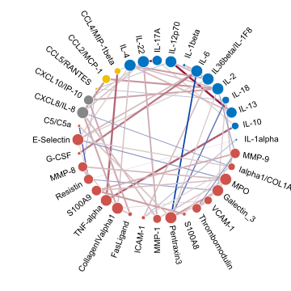

# anvis

This repository contains the source files for `anvis`: Automated Network 
VISualization. The package is aimed at facilitating interpretation and 
comparison of networks by visualizing derived network properties.

Below a demonstration of the type of visualization that `anvis` would 
generate by default: 



### Installation and use

For installation of the package run:

```
if (!requireNamespace("BiocManager", quietly=TRUE))
    install.packages("BiocManager")
BiocManager::install("anvis")
```

Read the vignette to learn more about the package features and how to use them.
