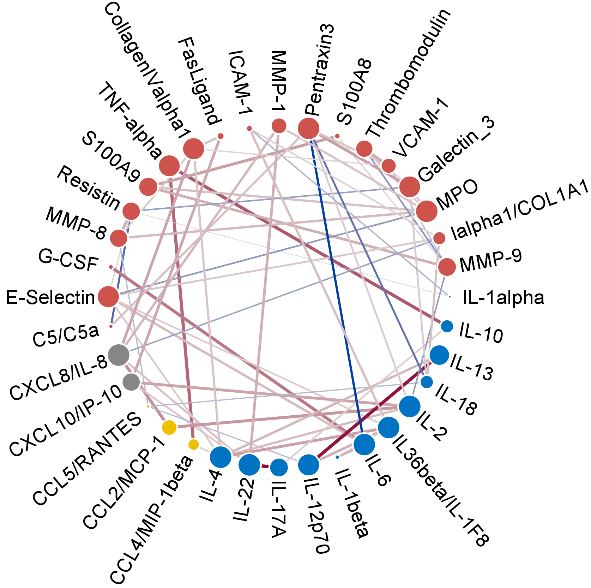

```{r, include = FALSE}
knitr::opts_chunk$set(
  collapse = TRUE,
  comment = "#>", 
  fig.height = 7, # Set default for showing a single network 
  fig.width = 8
)
```

# Introduction 

## About `anvis`

The `anvis` package was developed to automate the process of creating network 
visualizations. It generates visual styling for network properties to highlight 
the most relevant features. In addition, the package is prudently suited to 
create multiple network comparisons to study different states of the given 
system. The basic visualization tools and functions (pre-requisite to applying 
anvis skins) are imported from popular network visualization platforms: 
`r CRANpkg("igraph")`, and [Cytoscape](https://cytoscape.org/) (via 
`r Biocpkg("RCy3")`). Any user familiar with these software packages will be 
easily able to extend and customize the visualizations made with `anvis`. `anvis` 
can be integrated in any user-defined analysis pipeline, to this end `anvis` 
offers exports of networks and the added attributes (e.g. node size and edge color) 
in various common formats. Relatively small networks offer optimal results, so 
it is recommended to include a maximum of 100 nodes (variables) or 500 edges 
(similarity scores or similar relations). 

* Brief review of similar packages (create a list and discuss with Sanjee, 
possibly integrate this: For visualization of larger networks we refer users to 
the package `r Biocpkg("netbiov")`, as this package offers a variety of options 
aimed at visualization of large networks.)
* short motivation of the package (copy from fellowship application)

## Installation

For installation of the package run the following code:

```{r installation, eval=FALSE}
if (!requireNamespace("BiocManager", quietly=TRUE))
    install.packages("BiocManager")
BiocManager::install("anvis")
```


## Brief demonstration of core functionalities

We will start by giving some demonstrations of the core functionalities of the 
package. Start by loading the package.

```{r loading}
library(anvis)
```

### Input data

`anvis` uses network data, which can be provided in multiple formats: 'graphNEL', 
'igraph', list of dataframes, or adjacency matrix. Two example 
datasets (`sepsis` and `paleo`) are integrated in the package and can be used for 
trying out the functions of `anvis`. Here, we use `sepsis` to showcase 
some key features. The `sepsis` dataset
consists of multiple adjacency matrices that show how similar the levels of 
selected proteins behave in different groups of hospital patients
(run `?sepsis` for more info).

The first matrix of `sepsis` looks as follows:

```{r sepsis_demo}
data1 <- sepsis[[1]]

# Show only part of the data and round to 3 decimals 
round(data1[1:15, 1:6], 3)

```

The above data shows partial correlations between protein levels. We will convert
the adjacency matrix into an object of a network data class in one of the 
following steps. 

Before this, we group the proteins of our example dataset, since this can yield 
more interesting visualizations later. In this case, we
will assign proteins into groups based on their protein family (shared parts 
of their name). 

```{r preview_create_groups}
# Create a vector that holds the names of all proteins
proteins <- colnames(data1)
proteins

# Assign a group label to each protein
# We find multiple proteins that include "IL", "CCL", or "CXCL" in their name.
#   These will be assigned their own group label
groups <- dplyr::case_when(
    stringr::str_starts(proteins, "IL") ~ "group A", 
    stringr::str_starts(proteins, "CCL") ~ "group B", 
    stringr::str_starts(proteins, "CXCL") ~ "group C", 
    TRUE ~ "group D")  # All other proteins will be group D
groups
```

### Preparing the network for visualization

Before making a visualization, we need to add additional attributes to our data
that will help with the visual styling of the network. `anvis` provides functions
to automate this process. The function `adjToNetwork` creates a network from an adjacency
matrix and adds additional attributes, the function `addVisAttrs` adds attributes
to an existing network of type "graphNEL", "igraph", or list of dataframes.

Since our example data is an adjacency matrix we will use `adjToNetwork` here. 
Possible output types for the network are "graphNEL", "igraph", or list of 
dataframes. Here we selected "igraph" as output type, since this will make it 
easy to demonstrate which attributes have been added to the network. 

```{r preview_attrs}
# Create network from adjacency, add all attributes for visual styling, 
#    incorporate group information.
net1 <- adjToNetwork(adj_mats = data1, 
                     node_attrs = "all", 
                     edge_attrs = "all", 
                     group_vec = groups,
                     output_as = "igraph")

# We chose to get an igraph object as output, below some info about this
#   network object
net1

# get edge attributes
igraph::list.edge.attributes(net1)

# get node attributes
igraph::list.vertex.attributes(net1)
```

We're left with a network that has a node for each protein and and edge to 
represent all non-zero partial correlations between the proteins. The additional
attributes that have been added for the edges are "width" and "color". These 
were determined based on the partial correlation values. Nodes have additional 
attributes "group", and "color" based on the groups they are assigned to, and 
attribute "size" based on the sum of the edges that are connected to a node. 

### Visualization of the network

Once additional attributes have been added to a network, we make use of the 
`anvis()` function to visualize it. `anvis()` offers a variety of options to 
customize the visualization. In addition, it can use different software 
(`r CRANpkg("igraph")`, and [Cytoscape](https://cytoscape.org/)) to generate the
visualization, or export the final network in various different formats. For now,
we make a basic visualization using the defaults (`igraph` will be used to 
generate our output). Other options will be showcased later in this vignette. 

```{r preview_fig, fig.height=7, fig.width=8}
anvis(net1)
```

# Example data available with package

We have included two datasets with the package so its functions can be 
tested. `sepsis` relates to protein levels in the blood of hospital patients, 
`paleo` relates to the abundance of chemical elements detected in ocean ground
drilling. Throughout this vignette we will use this data to showcase the 
package's features. More background on the datasets follows:

### `sepsis`

The levels of 36 selected proteins was measured in the plasma of hospital patients 
with one of three varieties of soft tissue infections (necrotizing soft tissue infection, 
non-necrotizing soft tissue infection, and cellulitis), and a in surgical control group.
Patients were divided into 12 groups based on characteristics of their disease. 
To create the groups, a distinction was made between the type of disease, whether
patients had a septic shock, and whether their disease had a mono-microbial or 
poly-microbial origin. Within each group, partial correlation was calculated 
between the level of the proteins, to generate the `sepsis` dataset. `sepsis`
is a list with 12 elements, each of which is an adjacency matrix of 36 rows and
columns, representing the similarity in the levels of the proteins measured in 
the patients (`?sepsis` for more info).


### `paleo`

To study the environmental change that occurred in the late Paleocene-early Eocene
period, deep sea drilling experiments were performed. The levels of trace elements
in the sediment of the sea were measured at different depths. The `paleo` dataset
is an adjacency matrix containing partial correlations that were calculated 
between the levels of the elements measured in the experiments. `paleo_mi` is 
a similar adjacancy matrix, containing mutual information values instead of 
partial correlation values (`?paleo` or `?paleo_mi` for more info). 

# Data input

`anvis` functions can use used with different types of network data. Depending 
on which data will be available, slightly different functions should be used

## Input of adjacency matrices

Adjacency matrices can be a valid input for creating visualizations with `anvis`, 
if they are square and contain names for the rows and columns. A single matrix 
may be used, or a list of several. Before a visualization can be made, the 
adjacency matrices should be converted into a network object. This can be done
with the function `adjToNetwork`. As demonstrated below, this function provides
the option to create directed networks and show self interactions between nodes
if this is relevant. 

```{r adj_to_net, fig.height=16}
# create network from 'paleo' (adjacency matrix)
net1 <- adjToNetwork(paleo)
net2 <- adjToNetwork(paleo, directed = T)
net3 <- adjToNetwork(paleo, directed = T, self_loops = T)

# add networks to a list
paleo_nets <- list("undirected" = net1, "directed" = net2, "self loops" = net3)

# Visualize the networks to show their different properties, for now make 
#   seperate visualizations for each network instead of showing them in a grid
anvis(paleo_nets, igr_grid = c(3,1), igr_grid_names = T)
```

For the `paleo` data having directed edges or self loops is not very informative,
as the adjacency matrix is symmetrical and all nodes have a perfect partial 
correlation with themselves. 

Use of `adjToNetwork` will by default return a network object of class `"graphNEL"`.
Depending on the workflow that the newly created network will be subjected to, 
other classes might be more relevant. For these cases, the parameter 'output_as'
of `adjToNetwork` can be changed to "igraph" or "list". 

The purpose of `adjToNetwork` is twofold. First, as demonstrated, it converts an
adjacency matrix into a network class object. Second, it adds additional 
attributes to the network that can be useful to create more clear visualizations.
Most of these attributes are added by default. However, there is a set of additional 
options that allows for customization and extension of the attributes that are 
added. These options will be explained in a following section. For adding 
attributes to networks, 
`adjToNetwork` uses the same parameters as the `addVisAttr` function, and can 
therefore be used in a similar way. 
    
## Input of network objects

With `anvis`, any network of class `"graphNEL"`, `"igraph"`, or list of data 
frames `"vertices"` and `"edges"` can be manipulated and visualized. To make use of the 
full set of features of `anvis`, networks require and edge weight attribute. 

To create a styled visualization of a network with `anvis`, first several 
attributes need to be added. The function `addVisAttr` automates this task. 
It comes with various options to customize the added attributes. This will
be elaborated in detail in the next section. 

# Adding attributes to networks

For making visualizations we add attributes, such as node group, color, and size,
and edge color and width, to networks. These attributes can all be added in a single step 
using `adjToNetwork` or `addVisAttr`. To demonstrate the available options we 
add the attributes individually below, and show which choices are available for
customization.

## No additional attributes

Addition of attributes to the network can be skipped, resulting in the most 
basic visualization. 

```{r no_attrs}
# We create a basic network from the paleo adjacency matrix, without additional
#   attributes. 
# This can be skipped if a network object is already available
paleo_net <- adjToNetwork(paleo, node_attrs = "none", edge_attrs = "none")

# Visualize without adding attributes
title <- "Network without additional attributes"
anvis(paleo_net, igr_plot_opts = list(main = title))
```

## Node groups and colors

Todo: 

* group vector either one for all networks or one for each

Nodes can be assigned to a group. This will place all nodes with the same group
label adjacent to each other in the visualization. To make distinction of groups easier,
each group can be assigned a color. The following code chunk shows how the group 
attribute can be added and which additional options are available.

```{r groups}
# get the nodes of the network
nodes_paleo <- graph::nodes(paleo_net)

# Create vector with group labels for each node
groups_paleo <- dplyr::case_when(
    stringr::str_detect(nodes_paleo, "%") ~ "group %", 
    stringr::str_detect(nodes_paleo, "kg") ~ "group mg/kg", 
    stringr::str_detect(nodes_paleo, "/Al") ~ "group /Al", 
    TRUE ~ "others") 

# Add group attribute
paleo_net <- addVisAttrs(paleo_net, node_attrs = "group", edge_attrs = "none", 
                         group_vec = groups_paleo)

# Visualize grouped network
title <- "Network with group attribute (nodes reordered)"
anvis(paleo_net, igr_plot_opts = list(main = title))

# Now also add colors for the groups
paleo_net <- addVisAttrs(paleo_net, node_attrs = "color_group", edge_attrs = "none")

# Visualization with group colors
title <- "Network with group and color_group (node 'color' attribute)"
anvis(paleo_net, igr_plot_opts = list(main = title))

# `colorblind` argument can be used to create node colors or overwrite them 
#   with colorblind accessible colors
paleo_net <- addVisAttrs(paleo_net, node_attrs = "color_group", edge_attrs = "none", 
                         colorblind = TRUE)

# Show network with colorblind accessible colors
title <- "Network with colorblind accessible colors"
anvis(paleo_net, igr_plot_opts = list(main = title))

# Custom colors can be used with "color_group"
custom_cols <- c("#4E79A7", "#F28E2B", "#E15759", "#76B7B2") # from ggthemes::tableau_color_pal(palette = "Tableau 10")(4)
paleo_net <- addVisAttrs(paleo_net, node_attrs = "color_group", edge_attrs = "none", 
                         group_colors = custom_cols)

# Show network with custom group colors
title <- "Network with custom group colors"
anvis(paleo_net, igr_plot_opts = list(main = title))
```

## Node size

A node size attribute can be added to networks with `adjToNetwork` or 
`addVisAttr`. To determine node sizes, these functions will determine the 
connectivity of a node by calculating the sum of 
all edges associated with it. The values for all nodes are scaled to range 0 to 1, and transformed
with a sigmoid to enhance the contrast of node sizes. Finally, node sizes are 
multiplied with a constant factor that is determined by the argument 'size_type'.
This will make sure that different output methods (igraph, Cytoscape, or export)
can be used with node sizes that match their defaults. 

```{r node_size}
# Add node size attribute
paleo_net <- addVisAttrs(paleo_net, node_attrs = "size", edge_attrs = "none")

# Visualize network with node size attribute
title <- "Network with node size determined by connectivity"
anvis(paleo_net, igr_plot_opts = list(main = title))

# When using cytoscape for visualization it's best to adjust node sizes to
#   Cytoscape's defaults. This can be done with the 'size_type' argument
# paleo_net <- addVisAttrs(paleo_net, node_attrs = "size", edge_attrs = "none", 
#                          size_type = "cytoscape")

# Visualize network with node size attribute
# anvis(paleo_net, output_type = "cytoscape")  ## Run only when cytoscape is active
```

The options that can be used with 'size_type' are: "igraph" (default), so node
sizes will be in the range 3 to 15, "cytoscape", nodes will be in the range 7 to
27, and "scaled_only" for nodes in range 0 to 1. 

When node sizes are added, it is possible to reorder the nodes based on the value
of this attribute. For this, the argument 'arrange_co' (for: arrange by connectivity) 
can be set to `TRUE`. If groups are found in the data, the nodes will be arranged
by connectivity inside the groups. We demonstrate this in the following.

```{r arrange_co}
# Add no new attribute, but arrange by connectivity
paleo_net <- addVisAttrs(paleo_net, 
                         node_attrs = "none", 
                         edge_attrs = "none",
                         arrange_co = TRUE)

title <- "Network with nodes arranged by connectivity"
anvis(paleo_net, igr_plot_opts = list(main = title))
```

## Edge colors

The weight of edges might include positive and negative values, and more or less
extreme values. A distinction between the different types of edges can be made 
by changing edge widths (next section) or by changing the color of the edges. 
`adjToNetwork` or `addVisAttr` can automatically determine edge colors based on
edge weights. By default, a divergent color palette will be used for edge 
weights that include negative values. For all positive values, a sequential 
color palette will be used. The following code demonstrates how the color 
attribute is added to a network.

```{r edge_color}
# Add edge color attribute to paleo_net (network with partial correlation edge
#   weights, containing positive and negative values)
paleo_net <- addVisAttrs(paleo_net, 
                         node_attrs = "none", 
                         edge_attrs = "color")

title <- "Network with edge colors for positive and negative values"
anvis(paleo_net, igr_plot_opts = list(main = title))

# Create new network for paleo_mi data (network with mutual information edge
#   weights, containing only positive values). Add same attributes as to the 
#   paleo_net network. 
paleo_mi_net <- adjToNetwork(paleo_mi, 
                         node_attrs = "all", 
                         group_vec = groups_paleo,
                         group_colors = custom_cols,
                         arrange_co = TRUE,
                         edge_attrs = "color")

title <- "Network with edge colors for exclusively positive values"
anvis(paleo_mi_net, igr_plot_opts = list(main = title))
```

### Custom edge color palette

The colors that are used for edges can be customized. For this, use the argument
'edge_color_func'. As input a function is required that takes as first argument 
a number, and returns a vector of colors, the length of which equals the input 
number. The first colors in this vector will be used for low edge weight values, 
the last colors will be assigned to high values.

Options for providing a custom color palette are using a function from a 
package (e.g. `r CRANpkg("pals")`), or creating your own (e.g. with 
`colorRampPalette`). The following code demonstrates how custom edge colors 
can be used. 

```{r color_func}
# we will use a custom sequential color palette for paleo_mi_net edge colors
# A convenient way to test a color palette is by using the pie function:
pie(rep(1, 40), col = pals::ocean.oxy(40))

# The first colors will be used for the lowest edge weight values. Here,
#   we prefer to use darker colors for the greatest edge weights, so the 
#   color palette needs to be reversed.
rev_pal <- function (n) rev(pals::ocean.oxy(n))

# We can now add our colors for the edges to the network
paleo_mi_net <- addVisAttrs(paleo_mi_net, 
                         node_attrs = "none", 
                         edge_attrs = "color", 
                         edge_color_func = rev_pal)

title <- "Network with custom edge colors (sequential)"
anvis(paleo_mi_net, igr_plot_opts = list(main = title))


# For paleo_net we will use a divergent color palette since it contains positive
#   and negative values. For demonstration purposes, we will use 
#   `colorRampPalette` to make our own color palette. 

# Create a palette that goes from green to orange
pal_gwo <- colorRampPalette(colors = c("darkgreen", "white", "darkorange"))

# Optional check if the palette behaves as expected. 
pie(rep(1, 40), col = pal_gwo(40))

# Add edge color attribute that used our gwo palette
paleo_net <- addVisAttrs(paleo_net, 
                         node_attrs = "none", 
                         edge_attrs = "color",
                         edge_color_func = pal_gwo)

title <- "Network with custom edge colors (divergent)"
anvis(paleo_net, igr_plot_opts = list(main = title))
```

Note: When colors are assigned based on edge weights that include both positive and negative 
values, the first half of the color palette will be used for the negative values,
the second half for the positive values. As consequence, it is important that 
divergent color spectra that are provided with 'edge_color_func' have the colors 
meant for values close to 0 exactly in the center of the color palette. For 
example, if the green orange color palette from above returns 40 colors by giving
10 for the green-white range, and 30 for the white-orange color range, edges 
would receive unexpected colors.

## Edge width

* The argument in the wrapper is vectorized

To distinguish between stronger and weaker connections between nodes, the edge 
'width' attribute can be added to a network. Using edge weight as edge width is 
not always appropriate, because different ranges of values may be 
found in networks to describe the strength of the association between nodes. 
For example, the range of correlations is between
-1 and 1, while the range of mutual information values may be between 0 and +∞.
Consequently, these values need to be transformed so they can be used as edge 
widths. `anvis` offers 5 algorithms for converting edge weights into useful edge 
widths. The algorithms can be set via the argument 'width_type' of `adjToNetwork`
and `addVisAttr`. The possible choices for this argument are: 

"cor", which is intended to be used with Pearson or Spearman correlation values 
(range -1 to 1). Widths will be the absolute value of the correlation, scaled 
with a sigmoid. "partcor", which is intended to be use for partial correlation 
values (range -1 to 1). For this method, edge widths will be the cube root of 
absolute weight values, scaled with a sigmoid. The option "MI" is meant to be 
used with weights derived from mutual information (range 0 to +∞). Widths will 
be the weights divided by to maximum weight, then scaled with a sigmoid. 
"default_scaling" applies the same transformation as "MI", as a result scaling 
the any weights to range 0 to 1. "ranked" will calculate percentage ranks of the 
weight, and scale them with a sigmoid. "percentile" will chose a set of fixed 
widths determined by the percentile of a weight value. The highest percentiles 
will be assigned the largest width, but they are the smallest group, vice versa 
for the lowest percentiles. 

Below we demonstrate how the edge width attribute can be added to a network, for
the case of partial correlation and mutual information data.

```{r width_type}
# Add edge width attribute, also overwrite gwo edge colors with the default colors
paleo_net <- addVisAttrs(paleo_net, 
                         node_attrs = "none", 
                         edge_attrs = c("width", "color"), 
                         width_type = "partcor")

title <- "Network with edge width attribute (for partial correlation)"
anvis(paleo_net, igr_plot_opts = list(main = title))


# Add edge width attribute to paleo_mi_net, also overwrite edge colors with the 
#   default colors.
paleo_mi_net <- addVisAttrs(paleo_mi_net, 
                         node_attrs = "none", 
                         edge_attrs = c("width", "color"), 
                         width_type = "MI")

title <- "Network with edge width attribute (for mutual information)"
anvis(paleo_mi_net, igr_plot_opts = list(main = title))
```

# Creating visualizations

For displaying and customizing visualizations, `anvis` provides the equally named
`anvis()` function. Both `r CRANpkg("igraph")`, and [Cytoscape](https://cytoscape.org/) 
can be used by this function to create visual output. 

To make visualizations with `r CRANpkg("igraph")` no additional actions are 
required. `r CRANpkg("igraph")` is installed at the same time as the `anvis` 
package, since it is an essential component. By default `anvis()` uses 
`r CRANpkg("igraph")` to create visualizations. 

To make visualization with [Cytoscape](https://cytoscape.org/), the software
needs to be installed separately. We suggest avoiding Cytoscape version 3.8.x,
since problems may occur when it is accessed with `r Biocpkg("RCy3")` (this 
package is used by `anvis` to communicate with Cytoscape). To be available for 
network visualizations with `anvis`, Cytoscape needs to be running on your machine. 

* EXPLAIN THE LOGIC BEHIND THE ARGUMENT NAMING? 

## Creating a basic visualization 

To create a basic visualization a network object is required, with the desired 
visualization attributes added. We will use a network created from our sepsis 
example data to demonstrate the available options for customizing visualizations.

```{r}
# Create grouping vector for the nodes of sepsis data
proteins <- colnames(sepsis[[1]])
groups <- dplyr::case_when(
    stringr::str_starts(proteins, "IL") ~ "group A", 
    stringr::str_starts(proteins, "CCL") ~ "group B", 
    stringr::str_starts(proteins, "CXCL") ~ "group C", 
    TRUE ~ "group D") 

# Create a network with node groups, color, and size, and edge width, and color
#   attributes added. We'll use the first network from our sepsis example data
sepsis_net <- adjToNetwork(sepsis[[1]], 
                           node_attrs = "all", 
                           edge_attrs = "all", 
                           width_type = "partcor", 
                           group_vec = groups)
```

### Igraph

To visualize our network with `r CRANpkg("igraph")` no additional argument is 
required for the `anvis()` function (as igraph is the default). 

```{r}
# Visualize with igraph (output_type = "igraph" is default)
anvis(sepsis_net)
```

### Cytoscape

Visualizations can be made in cytoscape with `output_type = "cytoscape"`. Since
the visualizations will be shown in the external software, we insert images in 
this vignette to show the output from cytoscape that users can expect.

```{r}
# First we check whether cytoscape is running. When this vignette is generated
#   cytoscape will not be active. For users replicating the code of this vignette,
#   with cytoscape running, the check should evaluate to TRUE
cyto_message <- testthat::capture_condition(RCy3::cytoscapePing())$message
cyto_active <- cyto_message == "You are connected to Cytoscape!\n"

cyto_active

# Omit check on personal machine
if (cyto_active) {
    anvis(sepsis_net, output_type = "cytoscape")
}
```

```{r, echo=FALSE, fig.cap="Basic visualization made with Cytoscape. ", out.width = '100%'}

```

Instead of showing the visualization in your active session of R or Cytoscape,
it is possible to save to the current working directory (or specified paths).
For Cytoscape, also session objects can be saved. Details on saving can are 
discussed in the [Saving](#saving) section of this document.

## Scaling edge widths

In some cases it might be helpful to rescale the edge widths, this can be done 
with the argument 'vis_edge_factor' of the `anvis()` function. The edge widths 
that are generated when edge attributes are added to a network will be in the 
range 0 to 1. This edge width is hardly noticeable in igraph or Cytoscape 
visualizations. Therefore, using the default for 'vis_edge_factor' (`NULL`), 
will cause `anvis()` to use scaling values 3.25 for igraph and 2 for Cytoscape. 

As an example for rescaling edge widths we will use more extreme values. For 
reference, see the example below. 

### Igraph

* sHOW AS 2x WIDER

```{r}
# to show igraph edges about 1.5x wider than default, we choose 4.5
#   as a edge scaling factor
anvis(sepsis_net, vis_edge_factor = 4.5)

```

### Cytoscape

```{r}
# to show igraph edges 1.5x wider, we need to choose 3 as a edge scaling factor
#   for cytoscape
if (cyto_active) {
    anvis(sepsis_net, output_type = "cytoscape", vis_edge_factor = 3)
}
```

* INSERT THE IMAGE FOR CYTOSCAPE

## Setting more node space

### Cytoscape

## Visualization of multiple networks

### Igraph 

* Options to visualize side by side
* manually adjust the layout of the grid
* add titles to the grid elements, either by hand or from the names of the list
* Point out that it can be helpful to change the margins

```{r, fig.width=7, fig.height=12}
proteins <- colnames(sepsis[[1]])
groups <- dplyr::case_when(
    stringr::str_starts(proteins, "IL") ~ "group A",
    stringr::str_starts(proteins, "CCL") ~ "group B",
    stringr::str_starts(proteins, "CXCL") ~ "group C",
    TRUE ~ "group D")

sepsis_net2 <- adjToNetwork(sepsis,
                           node_attrs = "all",
                           edge_attrs = "all",
                           width_type = "partcor",
                           group_vec = groups,
                           arrange_co = T)

anvis(sepsis_net2, output_type = "igraph", vis_save = F, igr_grid = c(4,3),
      igr_par_opts = list(mar=c(2,4,5,4)),
      igr_grid_names = T)
```


### Cytoscape

* Multiple networks can be visualized, but they are either show in the session or saved seperately. No option to show side by side. 
* One option to show graphs side by side: - [arrange network windows](http://manual.cytoscape.org/en/stable/Quick_Tour_of_Cytoscape.html#:~:text=Arrange%20Network%20Windows)
* for easiest comparison we recommend igraph

## Changing the layout of the nodes

### Igraph

* Explain how alternative layouts can be used, and how the node order can be maintained

## Directed networks
 
### Igraph

* Arrows, self loops
* Recommend to use cytoscape instead of igraph since it looks neater

### Cytoscape

* Arrows, self loops

```{r}

```

```{r, echo=FALSE, fig.cap="Directed network visualization made with Cytoscape. ", fig.height=8}
knitr::include_graphics("cyto_images/directed_net_temp.png")

# Note, currently height and width of cytoscape export cannot be adjusted

# test_that("cytoscape visualizes directed networks", {
#     test_call <- deparse(sys.calls()[[1]][1])
#     skip_if_not(test_call == "test_that()",
#                 message = "cytoscape visualizations need to be checked manually")
#     # Check if cytoscape is active
#     cytosc <- RCy3::cytoscapePing() %>% capture_condition()
#     skip_if_not(cytosc$message == "You are connected to Cytoscape!\n",
#                 message = "this test runs only when cytoscape is active")
# 
#     adj_mats <- readRDS(test_path("fixtures", "adj_matrix_list.rds"))[1:2]
#     adj_mats <- lapply(adj_mats, lower_tri_remix)
# 
#     group_vec <- readRDS(test_path("fixtures", "group_vec_adj_matrix.rds"))
# 
#     nets <- adjToNetwork(adj_mats = adj_mats, group_vec = group_vec,
#                          edge_attrs = "all", node_attrs = "all",
#                          arrange_co = TRUE, width_type = "partcor", directed = T)
# 
#     expect_error(anvis(nets, output_type = "cytoscape",
#                        vis_save = T, vis_export_opts = list(height = 7, width = 7)),
#                  NA)
# })
```

## Further customization

### Igraph

* give some examples, to demonstrate that the full set of options of igraph is still available
    + Change graphical parameter options with `par()` 
    + Various options because of the flexibility of igraph
    + radial labels have their own options to be adjusted
    
#### Overwriting visual attributes

```{r}
anvis(sepsis_net, igr_plot_opts = list(vertex.size = rep(c(5,15), times = 18)))
```

#### Changing options of `par()` 

```{r}
# small margins
anvis(sepsis_net, igr_par_opts = list(mar=c(1,1,1,1)))
```


```{r}
# large margins
anvis(sepsis_net, igr_par_opts = list(mar=c(6,6,6,6)))

```


### Cytoscape

Using `r Biocpkg("RCy3")` for further customization

* Show at least one example to change some visual features of the network.

## Saving {#saving}

* export types
* further export options
 
### Cytoscape

* Save image
    + export types
    + further export options
* Saving session
* Close session


# Exporting the networks

* make a note on how the exports can include the columns that have info for visual styling
* Example with xgmml and another type
* file save name and xgmml title

# Session info

This vignette was made with `r CRANpkg("rmarkdown")` and `r Biocpkg("BiocStyle")`. Below the output generated by `sessionInfo()` when this document was compiled:

```{r sessionInfo, echo=FALSE}
sessionInfo()
```


